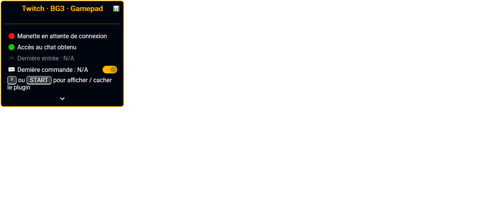

# Twitch BG3 Gamepad
  

Plugin sous la forme d'un script JavaScript à installer sur le navigateur.
Permet d'utiliser une manette de console pour envoyer les commandes au chat 
simplement et rapidement.

## Installation

1. Ouvrir le fichier [plugin.js](https://github.com/poirierlouis/twitch-bg3-gamepad/releases/latest).
2. Copier tout le code (`CTRL+A` > `CTRL+C`).
3. Ouvrir (ou accéder) à l'onglet Twitch, avec la chaîne et le chat d'ouvert.
4. Ouvrir la console de développeur (`CTRL+SHIFT+I`).
> Sur Chrome, un message d'avertissement vous demande d'écrire une commande 
> pour confirmer votre intention d'utiliser la console de développeur. Entrer 
> le texte demandé pour obtenir l'accès et continuer à l'étape suivante.
5. Coller le code dans la console.
6. Installer le plugin en validant avec la touche `Entrée`.
7. Fermer la console de développeur (`CTRL+SHIFT+I`).

## Mode d'emploi
1. Brancher une manette de console.
2. Appuyer sur une touche pour connecter la manette.
> Brancher uniquement la manette n'est pas forcément suffisant pour que le 
> navigateur la détecte.
3. Utiliser les touches et les joysticks de votre manette pour automatiquement 
   écrire et envoyer la commande au chat.
4. Maintenir une touche appuyée / le joystick dans une position pendant au 
   moins 400ms permet de générer une commande longue (ajoute le `+` devant la 
   commande).

Pour supprimer le plugin, il vous suffit d'actualiser la page (`F5`) ou de 
quitter l'onglet. Vous devrez reproduire la procédure d'installation pour 
utiliser le plugin à nouveau.

Vous pouvez passer en *mode test* pour tester la manette sans envoyer de 
commande au chat. Activer / désactiver ce mode via le bouton `(--o)` ou la 
touche `SELECT` de la manette.

Le plugin affiche quelques informations en haut à gauche du navigateur. Vous 
pouvez afficher/cacher l'interface en appuyant sur la touche `²` du clavier ou
la touche `START` de la manette.

En plus des boutons / joysticks de la manette, vous pouvez directement utiliser
les touches `&é"'(-è_çà)=` pour envoyer un nombre en commande. Les touches 
correspondent, dans l'ordre, aux commandes `1`, `2`, `3`, `4`, `5`, `6`, `7`, 
`8`, `9`, `10`, `11`, `12`. Cela fonctionne pour un clavier AZERTY sans 
maintenir la touche `SHIFT`.

Vous pouvez modifier des options en déroulant le panneau de configuration via 
l'icône `v`. Un changement prend effet en cliquant en dehors du champ modifié.
Les changements sont enregistrés dans votre navigateur. Ils seront restitués 
automatiquement lors de l'installation du plugin.

Les commandes envoyées sont enregistrées sur le navigateur. Cela permet d'
aggréger des statistiques d'usage par boutons / joysticks / touches du clavier.
Utiliser le bouton 📊 pour afficher / cacher vos statistiques. Vous pouvez 
exporter les données via le bouton 💾.

## Development

You need NPM (with Node.js) on your system.

1. Clone repository:
> git clone https://github.com/poirierlouis/twitch-bg3-gamepad.git

2. Setup project:
> npm install

3. Build project (default is release mode):
> npm run build

This will output a `plugin.js` which contains the entire codebase to copy/paste
in browser's DevTools. This is the file to release to users.

When developing, you can enable logging by changing 
[Plugin.logging](https://github.com/poirierlouis/twitch-bg3-gamepad/blob/1a23261f5ac7a0df97d0f47f9bd8009f562129b9/src/plugin.ts#L16) 
to `true`. 

You can open [plugin.html](plugin.html) in your browser and run project with hot-reload 
using:
> npm run watch
